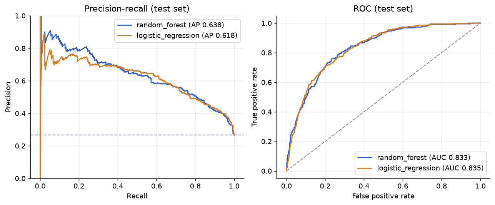
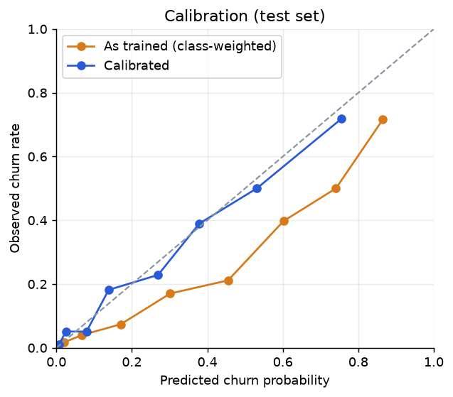
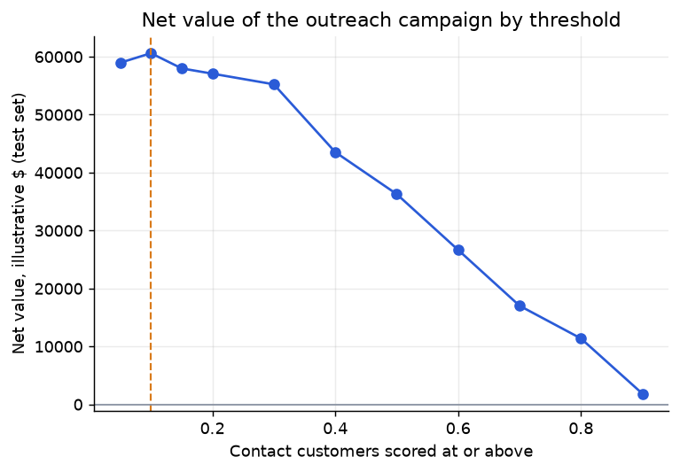
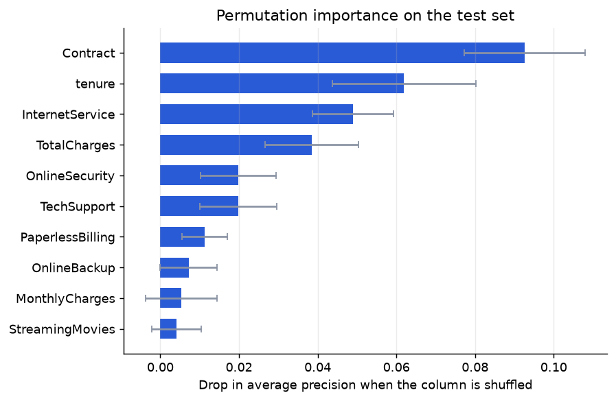

# Model report

Generated by `src/train.py`. Dataset: IBM Telco Customer Churn.

**Split.** 5,625 training and 1,407 test customers (stratified 80/20).
Test churn rate 26.6%.

**Which data was used for what**

| Step | Data it may use |
|---|---|
| Choosing between models | 5-fold cross-validation on the **training** rows only |
| Calibrating probabilities | **Training** rows only (isotonic, cross-validated) |
| Choosing the outreach threshold | **Training** rows only: out-of-fold calibrated probabilities and their labels |
| Final evaluation, including the locked threshold | The **test** rows, scored once, with nothing re-tuned |

## Results

| model               |   accuracy |   precision |   recall |    f1 |   roc_auc |   pr_auc |   cv_pr_auc |   cv_pr_auc_std |
|:--------------------|-----------:|------------:|---------:|------:|----------:|---------:|------------:|----------------:|
| majority_baseline   |      0.734 |       0.000 |    0.000 | 0.000 |     0.500 |    0.266 |       0.266 |           0.000 |
| logistic_regression |      0.726 |       0.490 |    0.797 | 0.607 |     0.835 |    0.618 |       0.659 |           0.013 |
| random_forest       |      0.747 |       0.516 |    0.789 | 0.624 |     0.833 |    0.638 |       0.663 |           0.015 |

Accuracy is shown for completeness but is a weak guide here: a model that predicts
"no churn" for everyone already scores 73%. PR-AUC is the honest
number, and the no-skill floor for it is the churn rate (0.27).

## How much noise is in these numbers

Bootstrapping the test set 2,000 times gives 95% intervals for **random_forest**:
ROC-AUC 0.810 to 0.855, PR-AUC 0.585 to 0.690.

**random_forest vs logistic_regression.** The paired PR-AUC gap has a 95% interval of
-0.008 to +0.042; random_forest was ahead in
92% of resamples. That interval includes zero, so this test set cannot separate the two models. random_forest was selected because it had the higher training cross-validation PR-AUC (0.663 against 0.659), which is a selection outcome and not a finding that it is better on new data. Neither model is claimed to be simpler or more interpretable here.

The companion apps ([`churnapp`](https://github.com/jayraj0975/churnapp) and
[`churn-predictor-android`](https://github.com/jayraj0975/churn-predictor-android)) do **not** serve the model selected here. They serve an
unweighted logistic regression exported from the web app's own training script; this report is the broader model comparison.

## Probabilities: rank first, calibrate second

Both models use `class_weight="balanced"`, which improves recall but makes raw scores
read far higher than the true churn rate. Isotonic calibration (fit with cross-validation
on training rows) fixes that without changing the ranking: Brier score
**0.166 to 0.140**. Use the calibrated model when a
number will be read as "this customer has an X% chance of leaving".

## Choosing a threshold by dollars, not by F1

Assumptions, **illustrative and not from any real company**: each retention offer costs
$25, an offer keeps 30% of the would-be churners it reaches,
and a kept customer is worth $780 of retained
annual billing (the average monthly bill times 12).

**Selection (training rows only).** Every training row is scored by a calibrated model that never saw
it, and the threshold with the highest net value on those rows is chosen. Values are per 1,000 customers so
they can be compared with the test set.

|   threshold |   contacted |   true_churners_reached |   wasted_offers |   net_value_per_1000 |   precision |   recall |
|------------:|------------:|------------------------:|----------------:|---------------------:|------------:|---------:|
|        0.05 |     4194.00 |                 1468.00 |         2726.00 |             42428.16 |        0.35 |     0.98 |
|        0.10 |     3587.00 |                 1418.00 |         2169.00 |             43045.96 |        0.40 |     0.95 |
|        0.15 |     2998.00 |                 1350.00 |         1648.00 |             42834.96 |        0.45 |     0.90 |
|        0.20 |     2658.00 |                 1288.00 |         1370.00 |             41766.90 |        0.48 |     0.86 |
|        0.30 |     2152.00 |                 1164.00 |          988.00 |             38857.45 |        0.54 |     0.78 |
|        0.40 |     1533.00 |                  934.00 |          599.00 |             32040.66 |        0.61 |     0.62 |
|        0.50 |     1076.00 |                  738.00 |          338.00 |             25918.25 |        0.69 |     0.49 |
|        0.60 |      769.00 |                  544.00 |          225.00 |             19212.38 |        0.71 |     0.36 |
|        0.70 |      415.00 |                  325.00 |           90.00 |             11675.41 |        0.78 |     0.22 |
|        0.80 |      244.00 |                  205.00 |           39.00 |              7443.47 |        0.84 |     0.14 |
|        0.90 |       53.00 |                   47.00 |            6.00 |              1719.62 |        0.89 |     0.03 |

There is a closed-form check on that. With calibrated probabilities, contacting a customer
with churn probability *p* is worth it when *p* x (save rate x annual value) exceeds the
offer cost, i.e. above **0.11**. The grid search lands
next to that break-even, which is a useful sanity check on the calibration.

The locked threshold is **0.10**. On the training rows it contacts 3587 of
5,625 customers at a net value of $43,046 per 1,000 customers.

**Final test (threshold locked, not re-tuned).** Scoring the untouched test set at 0.10: contact
917 of 1,407 customers, reach 357 real churners, waste
560 offers, net **$60,612** ($43,079 per 1,000 customers; precision
0.39, recall 0.95). The dollar figures are assumptions, editable in `src/common.py`; the
threshold is a business decision, not a property of the model.

The test-set grid for other thresholds is saved in `reports/threshold_test_reference.csv` for reference. It was **not**
used to choose anything, and picking the best row from it would put the test set back into model selection.

## What drives it

Permutation importance on the test set (how much average precision falls when a column is
shuffled), so it is measured on data the model has not seen and is reported per original
column rather than split across one-hot fragments:

## Customer risk scores

`reports/top_churn_risks.csv` scores every customer **out-of-fold**: each one is scored by a
model trained on the other folds, never by a model that saw them. The top-scored 10% of
customers churned at **76%**, against 27% overall.

## Provenance

| | |
|---|---|
| Code commit | `8cb1062343e0` |
| Dataset | `telco_customer_churn.csv`, SHA-256 `3d5c233415c1b42b...`, 7,043 rows (7,032 after cleaning) |
| Feature schema | 19 columns, hash `d92230f7c83bd12c...` |
| Libraries | Python 3.12.3, scikit-learn 1.9.1, numpy 2.5.3, pandas 3.0.6 |
| Seed / split / folds | 42 / 20% stratified test / 5 |
| Generated (UTC) | 2026-09-25T08:09:43Z |

Full detail is in `reports/metrics.json` under `provenance`.

## Honest limitations

1. **Association, not causation.** The model says which customers look like past churners,
   not that changing a contract type would keep them.
2. **One snapshot.** The data has no dates, so the split is random, not temporal. A real
   deployment should be validated on a later period.
3. **Public sample data.** IBM's Telco set is a teaching dataset with fixed columns; results
   will not transfer to another operator.
4. **The dollar figures are assumptions**, stated above and easy to change.
